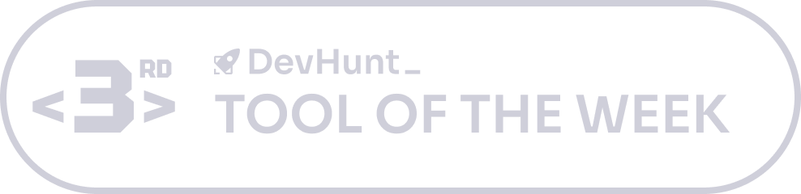

<meta name="google-site-verification" content="N98_sLzFZ2iYcmG407F0s2imY5bYGoOl8Vhs6kcxusw" />
<table align="center" border="0" cellpadding="0" cellspacing="0" style="border: none; border-collapse: collapse;">
  <tr>
    <td style="padding-right: 60px;">
      
    </td>
    <td>
      
    </td>
  </tr>
</table>

# Klyve
**The "Senior Partner" for AI Development.**
_Don't just chat with your AI. Manage it._

Klyve is a local-first SDLC orchestrator that puts you in charge of the Architecture, Backlog, and Sprints, while the AI handles the execution. For more information on how Klyve works and to download the binaries, visit [klyve.online](https://klyve.online)

---

### IP Protection, Build and Release
Klyve can be executed in native Python or compiled (using Nuitka) into a desktop application.
Build and package scripts for Windows (Installer) and Linux (AppImage) are included.
Documentation related to how Klyve's key internal IP is protected (when compiled and built), and the build and release process for Windows and Linux is available in the build_documentation folder.

---

### The Visual Tour

**1. From Idea to Spec**
Don't start from scratch. Upload raw requirements, and Klyve generates your UX/UI, Application, and Technical specifications.


**2. Automated Architecture**
Klyve generates the architecture, build scripts, and Docker containers before writing the code.


**3. Self-Healing Execution**
The "Senior Partner" engine detects build failures and attempts automatic bug fixes in real-time.


**4. Professional Deliverables**
Keep stakeholders happy with auto-generated traceability matrices and sprint reports.


---

### Release Notes & Troubleshooting

**Known Issues (Beta)**
* **Project Reports:** Four specific project reports have not yet been implemented in this release. The menu options for these in the *Reports Hub* will appear disabled.
* During a sprint, the AI sometimes takes a few minutes to generate the unit test scripts, during which time the system idles. Do not close the application. It will resume its work once the scripts are complete. 
* During the initial acceptance of the EULA, Linux users may have to click on the Privacy Policy tab twice for the Policy to be displayed. 
* On the first launch, the app takes several seconds to initialize itself before the EULA appears for acceptance. Subsequent startups will be quicker.
* When the EULA appears for acceptance on first launch of the app, Linux users will need to click twice on the Privacy Policy tab for the policy to be displayed.
  

**Troubleshooting**
* **Linux Users:** If Klyve fails to start after a re-install, you may need to clear the local database state. Run the following command in your terminal:
    ```bash
    rm -rf ~/.klyve
    ```
